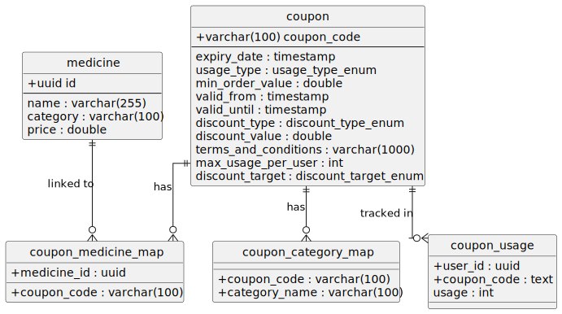

# Farmako Assignment Coupon API

This project implements a high-performance Coupon API for Farmako, designed using Go and PostgreSQL, with Docker-based deployment. The service provides endpoints to create, update, and validate discount coupons and efficiently fetch applicable coupons for user carts.

---

## 🧱 Architecture

- **Language**: Go (Golang)
- **Database**: PostgreSQL
- **Containerization**: Docker
- **Caching**: In-memory caching with TTL
- **Concurrency Control**: Row-level locking for consistency

---

## Database design

# Coupon System Schema

This document describes the schema design for a **Coupon System** that supports flexible discounting logic across medicines and categories. It enables usage tracking, category- and item-specific applicability, and rich metadata on coupon rules and constraints.

---

## 🗂️ Database Tables

### 1. `medicine`

| Column     | Type               | Nullable | Description                            |
| ---------- | ------------------ | -------- | -------------------------------------- |
| `id`       | `uuid`             | NO       | Primary key, unique ID for medicine    |
| `name`     | `varchar(255)`     | NO       | Name of the medicine                   |
| `category` | `varchar(100)`     | NO       | Category name this medicine belongs to |
| `price`    | `double precision` | NO       | Price of the medicine                  |

- **Primary Key**: `id`
- **Relations**: Referenced by `coupon_medicine_map`

---

### 2. `coupon`

| Column                 | Type                   | Nullable | Description                                                             |
| ---------------------- | ---------------------- | -------- | ----------------------------------------------------------------------- |
| `coupon_code`          | `varchar(100)`         | NO       | Primary key: Unique coupon identifier                                   |
| `expiry_date`          | `timestamp`            | NO       | Expiration datetime of the coupon                                       |
| `usage_type`           | `usage_type_enum`      | NO       | Coupon usage model: `one_time`, `multi_use`, `time_based`               |
| `min_order_value`      | `double precision`     | YES      | Minimum order value required to apply this coupon                       |
| `valid_from`           | `timestamp`            | YES      | Date-time from when the coupon is valid                                 |
| `valid_until`          | `timestamp`            | YES      | Date-time until when the coupon remains valid                           |
| `discount_type`        | `discount_type_enum`   | NO       | Type of discount: `flat`, `percentage`, `free_delivery`                 |
| `discount_value`       | `double precision`     | NO       | The actual discount value (amount or percentage based on type)          |
| `terms_and_conditions` | `varchar(1000)`        | YES      | Optional terms shown to the user                                        |
| `max_usage_per_user`   | `integer`              | YES      | Optional limit on how many times a user can use this coupon             |
| `discount_target`      | `discount_target_enum` | NO       | Target of the discount: `inventory`, `charges`, `inventory_and_charges` |

- **Primary Key**: `coupon_code`
- **Relations**:
  - Referenced by `coupon_medicine_map`, `coupon_category_map`, and `coupon_usage`

---

### 3. `coupon_medicine_map`

| Column        | Type           | Nullable | Description                         |
| ------------- | -------------- | -------- | ----------------------------------- |
| `coupon_code` | `varchar(100)` | NO       | Foreign key to `coupon.coupon_code` |
| `medicine_id` | `uuid`         | NO       | Foreign key to `medicine.id`        |

- **Primary Key**: Composite of `coupon_code` and `medicine_id`
- **Purpose**: Maps coupons to individual medicines
- **Usage**: A coupon applies to a medicine **only if** it's listed here (unless applicable via category)

---

### 4. `coupon_category_map`

| Column          | Type           | Nullable | Description                                |
| --------------- | -------------- | -------- | ------------------------------------------ |
| `coupon_code`   | `varchar(100)` | NO       | Foreign key to `coupon.coupon_code`        |
| `category_name` | `varchar(100)` | NO       | Category to which the coupon is applicable |

- **Primary Key**: Composite of `coupon_code` and `category_name`
- **Purpose**: Maps coupons to product categories
- **Usage**: Coupon applies to medicines within the specified category

---

### 5. `coupon_usage`

| Column        | Type      | Nullable | Description                                   |
| ------------- | --------- | -------- | --------------------------------------------- |
| `user_id`     | `uuid`    | NO       | User who used the coupon                      |
| `coupon_code` | `text`    | NO       | Foreign key to `coupon.coupon_code`           |
| `usage`       | `integer` | NO       | Number of times the user has used this coupon |

- **Primary Key**: Composite of `user_id` and `coupon_code`
- **Purpose**: Tracks how many times a user has used a specific coupon
- **Usage Enforcement**: Enforces `max_usage_per_user` where applicable

---

## 🧩 Enums

### `usage_type_enum`

| Value        | Description                                                  |
| ------------ | ------------------------------------------------------------ |
| `one_time`   | Can be used once globally                                    |
| `multi_use`  | Can be used multiple times per user (subject to limits)      |
| `time_based` | Valid only within a time range (`valid_from`, `valid_until`) |

### `discount_type_enum`

| Value           | Description                           |
| --------------- | ------------------------------------- |
| `flat`          | Fixed value discount (e.g., ₹50 off)  |
| `percentage`    | Percentage-based discount (e.g., 10%) |
| `free_delivery` | Waives delivery charges               |

### `discount_target_enum`

| Value                   | Description                                        |
| ----------------------- | -------------------------------------------------- |
| `inventory`             | Applies to item prices only                        |
| `charges`               | Applies to additional charges (e.g., delivery fee) |
| `inventory_and_charges` | Applies to both item cost and charges              |

---

## UML diagram



## 📐 Design Rationale

- **Extensibility**: Mapping tables (`coupon_medicine_map`, `coupon_category_map`) decouple coupons from business objects, supporting dynamic eligibility logic.
- **Validation Efficiency**: Foreign key constraints ensure data consistency and enforce relationships.
- **Enum Usage**: Promotes readability and type safety for categorical coupon properties.
- **Usage Tracking**: `coupon_usage` allows strict enforcement of per-user limits and tracking for analytics.
- **Flexible Discounting**: Coupons can target specific components of an order (`inventory`, `charges`) and apply different discount styles.

---

## ⚙️ Business Logic Summary

- A coupon **must be mapped** to either:
  - A set of `medicine_id`s via `coupon_medicine_map`, **or**
  - A set of `category_name`s via `coupon_category_map`.
- Eligibility is determined by whether the cart contains applicable medicines **or** categories.
- Coupons must also satisfy:
  - Valid time range (`valid_from`, `valid_until`)
  - Minimum order value, if specified
  - Usage limits per user, if any
  - Global expiration date (`expiry_date`)

## 📌 API Endpoints

### 1. **Add Coupons**

- **Endpoint**: `POST /admin/addCoupons`
- **Description**: Allows an admin to add new coupon definitions.
- **Body**: Coupon details including applicable medicines/categories, limits, and discount info.

### 2. **Update Coupon**

- **Endpoint**: `PUT /coupon/update`
- **Description**: Update an existing coupon’s details.
- **Body**: Coupon ID and fields to update.

### 3. **Get Applicable Coupons**

- **Endpoint**: `POST /coupon/applicable`
- **Description**: Returns all coupons applicable to a user's cart based on the medicines and categories in the cart.
- **Body**: List of cart items (medicine IDs and quantities).

### 4. **Validate Coupon**

- **Endpoint**: `POST /coupon/validate`
- **Description**: Validates if a given coupon is applicable for the cart and calculates the discount if valid.
- **Body**: Coupon code and cart items.

---

## 🚀 Caching Strategy

- **TTL Caching on Medicine Lookup**:  
  Frequently queried medicine data during the `/coupon/applicable` call is cached with a time-to-live (TTL) strategy.  
  This reduces repeated database hits for common items and improves overall performance.

---

## 🔒 Concurrency Strategy

- **Row-Level Locking During Coupon Validation**:  
  To ensure correctness in multi-user scenarios, the system locks the row corresponding to the coupon usage when validating and updating the usage count.  
  This avoids race conditions and ensures data consistency when multiple users try to redeem the same coupon simultaneously.

---

## 🐳 Running the Project

Make sure you have Docker and Docker Compose installed.

1. Clone the repo.
2. Run:

   ```bash
   docker compose up --build
   ```

   It will spin up the backend and populate the db.

3. Now API can be tested with below mentioned cURL requests.
4. To access Swagger documentation http://localhost:3000/swagger/index.html#/

# To Test the API

---

## - Add Coupons Endpoint

```bash
  curl -X POST http://localhost:3000/admin/addCoupons \
  -H "Content-Type: application/json" \
  -d '{
    "coupon_code": "WINTER2024",
    "expiry_date": "2024-12-31T23:59:59Z",
    "applicable_medicine_id": [
      "6f1f4c62-c420-49a6-8854-5d76f8d99770",
      "ac9bf4cd-3490-4aa1-a94e-71cc36d0a215"
    ],
    "applicable_categories": ["Diabetes", "Painkiller"],
    "usage_type": "multi_use",
    "min_order_value": 150.00,
    "valid_from": "2024-11-01T00:00:00Z",
    "valid_until": "2024-12-31T23:59:59Z",
    "terms_and_conditions": "Valid on winter collection items only",
    "discount_type": "percentage",
    "discount_value": 20.0,
    "discount_target": "inventory",
    "max_usage_per_user": 2
  }'
```

Response

```bash
  Coupon added successfully
```

## - Get Applicable Coupons

```bash
  curl -X POST http://localhost:3000/coupon/applicable \
  -H "Content-Type: application/json" \
  -d '{
    "timestamp": "2025-05-16T10:30:00Z",
    "order_total": 110,
    "cart_items": [
      {
        "id": "3fa85f64-5717-4562-b3fc-2c963f66afa6",
        "name": "Paracetamol 500mg",
        "category": "Pain Relief",
        "price": 25
      },
      {
        "id": "8e4cf3a9-d032-4709-a9c2-e3c4f9085e15",
        "name": "Azithromycin 500mg",
        "category": "Antibiotics",
        "price": 65
      },
      {
        "id": "c9d3e5a4-135a-4bb8-90ab-52e123a21abc",
        "name": "Cetirizine 10mg",
        "category": "Allergy",
        "price": 15
      },
      {
        "id": "52ab1b2f-fce4-4f1f-8fa9-c2f5b3c3b3d5",
        "name": "Simvastatin 20mg",
        "category": "Cholesterol",
        "price": 40
      }
    ]
  }'
```

Response

```bash
  {
    "applicable_coupons": [
      {"coupon_code": "ANTIBIO10", "discount_value": 11},
      {"coupon_code": "CHOL30OFF", "discount_value": 30},
      {"coupon_code": "FLAT20PAIN", "discount_value": 20},
      {"coupon_code": "LORA15", "discount_value": 15},
      {"coupon_code": "NEWYEAR2025", "discount_value": 25},
      {"coupon_code": "PERCENT10ALLERGY", "discount_value": 11},
      {"coupon_code": "SAVE10", "discount_value": 11},
      {"coupon_code": "SAVE5ALL", "discount_value": 5.5},
      {"coupon_code": "TOO_MUCH_DISCOUNT", "discount_value": 132}
    ]
  }
```

## - Validate a Coupon for Medicines

```bash
  curl -X POST http://localhost:3000/coupon/validate \
  -H "Content-Type: application/json" \
  -d '{
    "user_id": "b7e4a6f2-4444-5555-6666-abcdefabcdef",
    "coupon_code": "DIAB10",
    "timestamp": "2025-05-16T10:30:00Z",
    "order_total": 65,
    "cart_items": [
      {
        "id": "6f1f4c62-c420-49a6-8854-5d76f8d99770",
        "name": "Metformin 500mg",
        "category": "Diabetes",
        "price": 35
      },
      {
        "id": "ac9bf4cd-3490-4aa1-a94e-71cc36d0a215",
        "name": "Glibenclamide 5mg",
        "category": "Diabetes",
        "price": 30
      }
    ]
  }'
```

Response

```bash
  {
    "discount": {
      "charges_discount": 0,
      "items_discount": 6.5
    },
    "is_valid": true,
    "message": "Coupon applied succesfully",
    "order_value_after_discount": 58.5
  }
```
